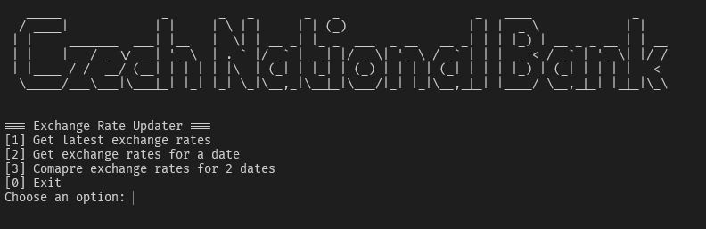

# Exchange rate updater
This is a .NET 6 console app that provides exchange rates from the Czech National Bank (CNB) for the CZK currency.

## Decisions made for the task
### Data Source
I decided to use the official CNB API: https://api.cnb.cz/. It is a documented official data source, updated daily, that provides foreign currency exchange rates in a fixed format.
- Endpoint for latest rates https://api.cnb.cz/cnbapi/exrates/daily?lang=EN

### Console app
I decided to go with a console app as it is the app type provided by the template. Also since I already have a public open source api project, I decided it would fit perfectly to display my skills in another .NET technology.
#### .NET 6
I chose to remain on the provided .NET 6 version rather than upgrading, since the task requirements did not specify an upgrade, and the project template builds correctly out of the box with .NET 6.
In a real-world scenario, upgrading the target framework of an existing project can introduce many breaking changes, and it would require extensive testing, and careful planning. Framework upgrades should be thoroughly though out and coordinated with other parts of the software.
Using .NET 6 does not pose any limitations for this project, and I am fully comfortable working with older .NET versions when appropriate.
### Architecture
The app uses a layered architecture with dependency inversion, built on top of .NET Generic Host. 
- It uses dependency injection to provide loose coupling and easy testing, as components depend on abstractions.
- It uses a `HttpClient` with retry policy using `Polly`. This adds support for transient failures.
- It uses configuration management for external settings. Makes it easy to configure different environments.
- It comes with a separate testing project with unit testing, without requiring the real API or console interaction. 
#### Logging
For logging I used `ILogger` and `System.Console` interchangeably, with separation of responsibilities.
- `ILogger` for system relevant logs, process tracking and errors.
- `System.Console` for user relevant logs and user interaction.
#### MenuHandler
I have added a console menu with a simple lifecycle loop for the user interaction layer. This way I separate the business logic from the user UI. It has these available programs:
- `[1] Get latest exchange rates`
	- Displays the latest exchange rates that match the supported currencies
	- Uses `ExchangeRateProvider.GetExchangeRates`
- `[2] Get exchange rates for a date`
	- Asks the user to input a date until its valid
	- Displays exchange rates for the day that match the supported currencies
	- Uses `ExchangeRateProvider.GetExchangeRatesFromDay`
- `[3] Compare exchange rates between 2 dates`
	- Asks the user to input 2 dates one by one until they are valid
	- Displays the calculated difference between the rates of the 2 dates
	- Uses `ExchangeRateProvider.CompareExchangeRatesBetweenDates`
- `[0] Exit`
	- Closes the application
  
On each action finish, apart from `[0]`, it prompts the user to `Press Enter to continue`. On `Enter` it clears the console and displays the menu, thus completing the loop.
#### ExchangeRateSource
I decided to use a `IExchangeRateSource` to implement a data obtainer. This design provides a swappable source, so if in the future instead of getting the data from a api, I needed to get it from a database, I would only need create a new implementation of the interface and register it.
#### ExchangeRateProvider
It implements the interface `IExchangeRateProvider` which allows for easy testing. It uses private helper methods to assist in its function, and makes the logic reusable.
- `ProcessExchangeRates` Processes incoming `ExchangeRateDTO` to match supported currencies
- `CompareExchangeRates` Compares 2 lists of `ExchangeRateDTO`, using only those who match the supported currencies, and returning a list of `ExchangeRateDifference` with calculated difference values.
- `IsExchangeRateDTOValid` Validates if the provided `ExchangeRateDTO` is valid.
- `ExchangeRateMapDTOToModel` Maps provided `ExchangeRateDTO` to the internal domain model.

This design implements SRP, where the `GetExchangeRates` method is only in charge of orchestrating the data intake and the processing of the exchange rates. Also it makes the helper methods reusable for other future functions in the provider.
#### Why add ExchangeRateDifference entity?
This additional entity allows for separation of concerns and keeps the domain model focused on each entities function. It also improves maintainability as it ensures updates to calculations don't affect the `ExchangeRate` entity.
#### Error Handling
I implemented a `ExchangeRateSourceException` to help with maintainable error handling. In addition, exceptions are caught and logged as close to their origin as possible. It allows for detailed logging and shields from throwing low level exceptions, revealing implementation specific details to above layers.

## Known issues
- `ILogger` logging sometimes lags behind `Console.WriteLine`. This is caused by the `ILogger` buffer, as it asynchronously prints messages, compared to `Console.WriteLine` which writes right away.  This issue can sometimes place logger messages in between console messages.
	- Fix: Introduce a dedicated `ConsoleLogger` with flushable wrapper, to make sure the `ILogger` buffer empties before proceeding with execution
- Sometimes at app startup the menu doesn't get displayed right away. This happens cause the main method is async, and the console initialized before the first `Console.WriteLine` in the menu handler is executed.

## Improvements
- Update .NET to latest version. This would benefit app maintenance and security, but as explained above i ruled it out of the scope of this template project.
- Add external json files for storing supported currency data.
- Add caching layer for exchange rates. Exchange rates are static and they only update once a day with a new one. This kind of data would benefit from caching as the data wouldn't change for 2 request of the same rate. 
- Utilize more available endpoints of the CNB API for more features.
	- Monthly averages
	- Monthly cumulative averages
	- Quarterly averages
- Add integration testing for the `MenuHandler` interactions. 
- Replace numerical console programs with named ones. `[1]` -> `lt` for latest rates
- Add `IExchangeRateDifferenceCalculator` for managing different ways of calculating the rate differences, instead of doing the calculation on the `CompareExchangeRates` method. This would separate concerns, and be able to add different calculation methods, like `LogarithmicDifferenceCalculator`,  without modifying the implementation.

## How to run the project
### Requisites
- .NET 6.0 SDK installed on your machine.
### Building and Launching the App
#### Build the solution
`dotnet build ExchangeRateUpdater.sln`
#### Run the application
`dotnet run --project ExchangeRateUpdater/ExchangeRateUpdater.csproj`
### Executing Unit Tests
#### Run all tests
`dotnet test ExchangeRateUpdater.Tests/ExchangeRateUpdater.Tests.csproj`

## Credits
Menu title font from https://patorjk.com/software/taag